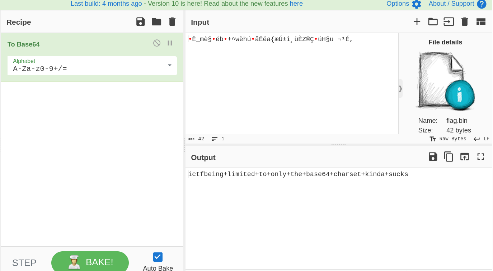

# Base64 Decryption - CTF Challenge Writeup

## Challenge Information
- **Name**: Base64 Decryption
- **Points**: 50
- **Category**: Crypto

## Objective
The objective of the "Base64 Decryption" CTF challenge is to decipher a flag hidden within a provided binary file. Participants must leverage their knowledge of cryptographic techniques, particularly Base64 encoding and decoding, to reveal the flag.

## Solution
Solving the "Base64 Decryption" challenge involves uncovering the hidden flag within the binary file by applying Base64 encoding and decoding techniques. While the initial approach may seem unconventional, understanding the challenge name provides a valuable hint. Here's a step-by-step guide on how I approached this task:

1. **Analyze the Binary File**:
   - Begin by examining the provided binary file. Initially, it may not be clear how to extract the flag, but it's essential to inspect the file to gain insights.

2. **Recognize the Challenge Name**:
   - The name of the challenge, "Base64 Decryption," suggests that Base64 encoding and decoding could be involved in solving the challenge.

3. **Initial Decoding Attempt**:
   - Start by attempting to decode the binary file using a Base64 decoding tool. This is a logical first step when Base64 is mentioned in the challenge name.
   - However, in this case, the straightforward Base64 decoding process does not reveal the flag.

    

4. **Exploring Character Sets**:
   - To troubleshoot the initial decoding failure, experiment with different character sets and decoding options in the Base64 decoding tool.
   - Despite trying various character sets, the flag remains elusive.

    

5. **Encoding into Base64**:
   - In a rather unconventional move, consider encoding the binary file into Base64 rather than decoding it.
   - Use a Base64 encoding tool or function to perform this operation on the binary file.

    

6. **Flag Extraction**:
   - Astonishingly, encoding the binary file into Base64 reveals the hidden flag.
   - The flag, presented in the format `ictf{XXXXXXXXXX}`, is generated as a result of the encoding process.

By following these steps, participants can successfully extract the flag from the binary file by encoding it into Base64, rather than the more traditional decoding process.

## Flag
The flag is in the format `ictf{XXXXXXXXXX}`. By encoding the binary file into Base64, you will generate and uncover the flag, which can be submitted for completion of the challenge.
