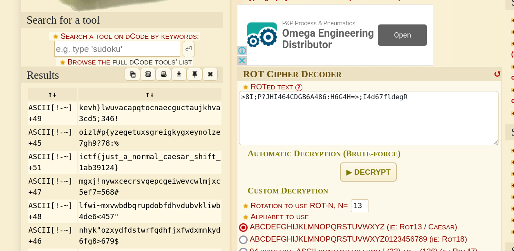

# Caesar - CTF Challenge Writeup

## Challenge Information
- **Name**: Caesar
- **Points**: 30
- **Category**: Crypto

## Objective
The objective of the "Caesar" CTF challenge is to decrypt an encrypted text. The challenge is based on the Caesar cipher, a simple and commonly used substitution cipher.

## Solution
Solving the "Caesar" challenge revolves around decrypting the text that has been encrypted using a Caesar cipher. Here's a step-by-step guide on how I tackled this task:

1. **Examine the Encrypted Text and Challenge Title**: The challenge provides an encrypted text and hints at the use of a Caesar cipher. The Caesar cipher is a substitution cipher that shifts the characters in the text by a fixed number of positions.

2. **Attempt Caesar Brute Force Tools**: I initially attempted to use various Caesar cipher brute force tools to automatically decrypt the text. However, none of these tools provided a successful solution.

3. **Try ROT Brute Force**: In search of a more effective solution, I explored the ROT (Rotation) cipher brute force tool available at [dCode](https://www.dcode.fr/rot-cipher). This tool allows you to brute-forces all possible ROT combiantions to decrypt the text.

    

By following these steps and using the dCode ROT cipher tool to perform a Caesar cipher brute force, I was able to decrypt the text and retrieve the hidden flag.

## Flag
The flag is in the format `flag{XXXXXXXXXX}`. After successfully decrypting the text using the correct Caesar cipher rotation position, you will be able to find and submit the flag.

**Note**: The actual flag value has been intentionally omitted here, as it is part of the challenge's solution and should be kept secret for a fair competition.
