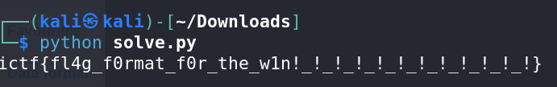

# xor64 - CTF Challenge Writeup

## Challenge Information
- **Name**: xor64
- **Points**: 50
- **Category**: Cryptography

## Objective
The objective of the "xor64" CTF challenge is to decipher a given base64-encoded string to reveal the hidden flag. Participants need to apply XOR operations with a specific key to unlock the flag. The challenge tests your understanding of XOR encryption and decoding.

## Solution
Solving the "xor64" challenge involves decoding a base64-encoded string and applying XOR operations with a particular key to uncover the flag. Here's a step-by-step guide on how I approached this task:

1. **Base64 Decoding**:
   - Begin by attempting to decode the provided base64-encoded string. This is a typical starting point for decoding challenges.
   - After decoding the string, examine its contents. However, you might not immediately find the flag.

2. **Exploring the Title Hint**:
   - Notice that the challenge title, "xor64," suggests that XOR operations are involved.
   - Attempt XOR operations with the number 64, as it may seem relevant. However, this does not reveal the flag.

3. **XOR with Numeric Range**:
   - Try performing XOR operations on the base64-decoded message with a range of numeric values from 0 to 64. This is a common approach in XOR-based challenges.
   - Unfortunately, this method does not produce the flag either.

      

4. **Reverse XOR Process**:
   - Reverse the XOR process by applying XOR with numbers from 0 to 64 and then attempting to base64-decode the result. This approach aims to find the original flag but does not yield the desired outcome.

5. **Try XOR with 'ictf'**:
   - Given the lack of success with numeric values, try XOR operations with the key 'ictf.'
   - This XOR operation reveals the hidden flag.

      

The key process to solve the challenge is to decode the base64-encoded string and XOR it with 'ictf.'

## Flag
The flag is in the format `ictf{XXXXXXXXXX}`. To uncover the flag, participants should decode the base64-encoded message and XOR it with 'ictf' as the key. Once completed, the flag can be submitted to finalize the challenge.
