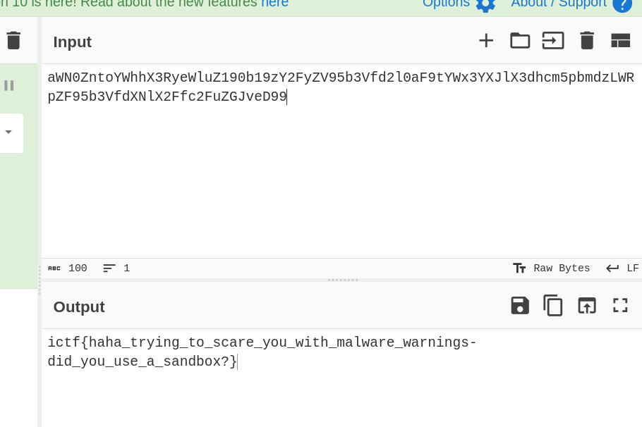

# Malware CTF Challenge Writeup

## Challenge Information
- **Name**: Malware
- **Points**: 42
- **Category**: Misc

## Objective
The objective of the "Malware" CTF challenge in the Misc category is to identify the flag hidden within the challenge files.

## Solution
To successfully complete the "Malware" CTF challenge, I followed these steps:

1. **Analyzing the Downloaded File**:
   - Upon downloading the file, the presence of a file named 'a' containing EICAR virus test files might suggest malware.
   - EICAR test files are commonly used for anti-malware testing.

2. **Locating the Flag in flag.txt**:
   - Instead of focusing on the 'a' file, direct attention to the 'flag.txt' file.
   - The flag is hidden within this file.

3. **Decoding Base64 Content**:
   - Open 'flag.txt' and observe its contents.
   - Convert the contents from base64 encoding to reveal the hidden flag.

        