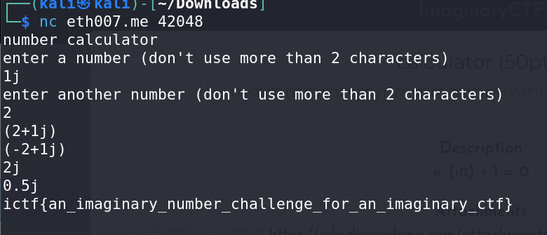

# Calculator - CTF Challenge Writeup

## Challenge Information
- **Name**: Calculator
- **Points**: 50
- **Category**: Miscellaneous (Misc)

## Objective
The objective of the "Calculator" CTF challenge is to understand the given Python source code and identify the logic or condition that leads to the flag's retrieval.

## Solution
To successfully complete the "Calculator" challenge, participants need to analyze the provided Python source code and understand why the given error occurs. Here is a step-by-step guide on how I approached and solved this challenge:

1. **Source Code Analysis**:
   - Start by examining the provided Python source code.
   - The source code involves mathematical calculations on two user-input numbers using the `eval` function.

2. **Error Triggered by Code Block:**:
   - Now, analyze the source code that contains the challenge code:

      ```python
      number_1 = input("enter a number (don't use more than 2 characters)\n")[:2]
      number_2 = input("enter another number (don't use more than 2 characters)\n")[:2]
      try:
        number_1 = eval(number_1)
        number_2 = eval(number_2)
        print(number_1 + number_2)
        print(number_1 - number_2)
        print(number_1 * number_2)
        print(number_1 / number_2)
        try:
          print(max(number_1, number_2))
          print(min(number_1, number_2))
        except:
          with open("flag.txt") as flag:
            print(flag.read())
      except:
        print("no")
      ```

3. **Explanation and Conclusion**:
   - The code block first takes user input and limits it to the first two characters using slicing.
   - It then attempts to evaluate these inputs as numbers using the eval function and performs several arithmetic operations.
   - The inner try block involves calculating the maximum and minimum of the two input numbers.

4. **Exploit**:
   - An imaginary number (j in python) succesfully complete the mathematical calculations in the outer try block with no problems 
   - But when the inputs are being passed into `min()` and `max()`, it will cause an error 
   - This error occurs because the `min()` and `max()` function is attempting to compare a complex number (j) with an integer, which is not supported.

5. **Flag Retrieval**:
   - To retrieve the flag, participants should submit input that triggers the error, resulting in the execution of the inner except block.
   - The flag should be presented in the format ictf{XXXXXXXXXX}.


    

In summary, the "Calculator" CTF challenge involves understanding and exploiting an error in the provided Python source code. By triggering the error, participants can access the contents of the "flag.txt" file and obtain the flag.