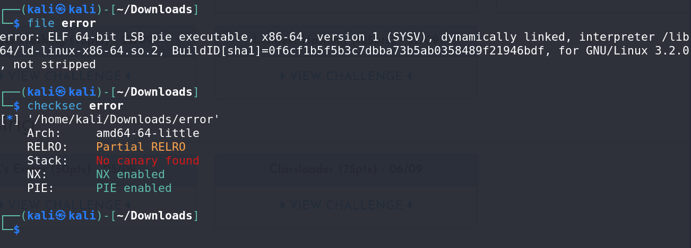
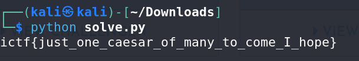

# C's Error - CTF Challenge Writeup

## Challenge Information
- **Name**: C's Error
- **Points**: 50
- **Category**: Reversing

## Objective
The goal of the "C's Error" CTF challenge is to reverse engineer a binary file to uncover a hidden flag. Participants are presented with a binary and must dissect it to understand how it processes user input and what actions trigger the flag's reveal.

## Solution
Solving the "C's Error" challenge involves reversing a provided binary to identify the correct actions and input required to reveal the hidden flag. Here's a step-by-step guide on how I approached this task:

1. **Initial Analysis**:
   - Begin by inspecting the binary file. Use tools like `file` and `checksec` to gain an understanding of the binary's characteristics.

        

2. **Reversing Challenge Suspicions**:
   - Based on the initial analysis, determine the binary's security features. In this case, the binary appears to be well-protected, indicating that the challenge will likely involve reversing.

3. **Function Inspection**:
   - Dive into the binary's functions to identify any interesting or relevant functions. In this challenge, focus on the `run` function, which is a prime candidate for analysis.

        

4. **Analysis of "Run" Function**:
   - Carefully examine the `run` function. It's observed that this function performs XOR operations with user input and a constant string, `enc`.
   - Attempt to locate the constant string used in the XOR operation. This string is a crucial component in deciphering the challenge.

        

5. **XOR Key Exploration**:
   - Initially, try to brute force the XOR key for the identified constant string. This approach is common in reversing challenges but may not be effective in this case.

6. **Raising Exceptions**:
   - Upon further scrutiny, discover that the binary uses the  `raise` function to raise exceptions or signals in response to certain conditions.

7. **Signal Checking Function**:
   - Explore another function, named `check`. In this function, signals are checked for specific values.
   - Notice that if signal 11 is encountered, the binary prints "well done".

        

8. **Solution Revelation**:
   - Based on the signal checking, consider using XOR with the key 11 on the constant string.
   - When the user input is XORed with 11, the expected result triggers signal 11 and leads to the binary printing "well done".
   - This revelation unveils the hidden flag, and you can extract it as a result of the XOR operation with the key 11.

        

By following these steps and understanding the binary's behavior, participants can successfully extract the flag and complete the "C's Error" CTF challenge.

## Flag
The flag is in the format `ictf{XXXXXXXXXX}`. By performing the XOR operation with the key 11 on the identified constant string, you can reveal the flag and submit it to complete the challenge.
